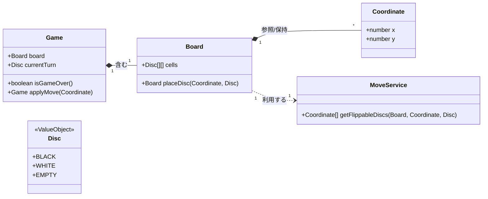

# 💎 reversi_app_react - React & TypeScript による オセロゲーム

## 🚀 TDDとDDD (ドメイン駆動設計) を採用した高信頼性実装

### 概要

本プロジェクトは、モダンなフロントエンド技術（React/TypeScript）を用いて開発されたブラウザ版オセロゲーム（リバーシ）です。

複雑なゲームロジックとUIを完全に分離するため、**ドメイン駆動設計（DDD）** に基づくクリーンアーキテクチャを採用しました。すべてのゲームロジックは **テスト駆動開発（TDD）** で実装されており、高い保守性と堅牢性を保証しています。

---

### 🛠️ 採用技術（Technology Stack）

| 分野 | 技術/ライブラリ | 備考 |
| :--- | :--- | :--- |
| **主要技術** | React, TypeScript | 厳密な型定義とコンポーネント指向 |
| **設計原則** | ドメイン駆動設計（DDD）、クリーンアーキテクチャ | - |
| **開発手法** | テスト駆動開発（TDD） | テストコードを仕様書として活用 |
| **テスト** | Jest, @testing-library | ドメインロジックの100%カバレッジを目標 |
| **実行環境** | Docker, Docker Compose | Node.js v24.11.1 で環境を統一 |

---

### 🧱 設計思想とアーキテクチャ

#### 1. アーキテクチャの概要

ロジックを格納する **`core/` (ドメイン/アプリケーション層)** は、UIを格納する **`presentation/` (UI層)** から完全に分離されています。これにより、UI技術の変更や、将来的なバックエンド連携にも柔軟に対応できる構造を実現しています。

#### 2. DDDの適用詳細

ゲームのルールを正確にモデリングするために、以下のDDDの要素を適用しました。

| DDD要素 | 適用クラス | 設計上の役割 |
| :--- | :--- | :--- |
| **集約 (Aggregate)** | `Game` | 盤面(`Board`)や手番をカプセル化し、ゲームの状態の整合性を保証するルートエンティティです。 |
| **値オブジェクト (Value Object)** | `Board`, `Coordinate`, `Disc` | すべて不変 (Immutable) として設計。状態の意図しない変更を防ぎ、TDDによるテストの容易性を高めています。 |
| **ドメインサービス** | `MoveService` | 「ひっくり返す石の計算」という複雑なアルゴリズムを独立させ、`Game`クラスの責務を軽量化しています。 |

#### 3. ドメイン設計図 (クラス図)

DDDの核となるクラスの関係性です。


#### 4. TDDによる品質保証

- **ドメイン層 (Logic)**: すべてのゲームロジックに対し、高いテストカバレッジを維持しています。テストコードがオセロのルールが正確に実装されていることの保証書です。
- **テストの実行**: Dockerコンテナ内で `npm run test` コマンドで実行可能です。

---

### 💻 環境構築と実行手順（Docker）

本プロジェクトは、Node.js v24.11.1 環境で動作するよう Docker で環境構築されています。

#### 1. ビルドと起動

プロジェクトルートで以下のコマンドを実行します。

```bash
# 1. リポジトリをクローン
git clone [このプロジェクトのリポジトリURL]
cd reversi_app_react

# 2. Dockerコンテナのビルドと起動
# Dockerfileとdocker-compose.ymlに基づき、依存関係をインストールします。
docker-compose up --build -d
```

#### 2. アクセスと開発

コンテナ起動後、ブラウザで以下にアクセスしてください。
```
http://localhost:3000/
```
#### 3. テストの実行

TDDに基づき、テストはコンテナ内で実行します。

```bash
# 実行中のコンテナに入る
docker exec -it reversi_app_react sh

# Jestコマンドを実行
npm run test
```
### 💡 今後の展望/改善点（Future Work）

- **AI対戦機能の実装**: 現在は2人対戦のみですが、ミニマックス法を用いたAIロジックをサービスとして実装し、対戦相手として提供します。
- **履歴機能の追加**: 過去の手順に戻る（Undo）機能を、DDDの概念であるイベントソーシングを参考に実装する予定です。